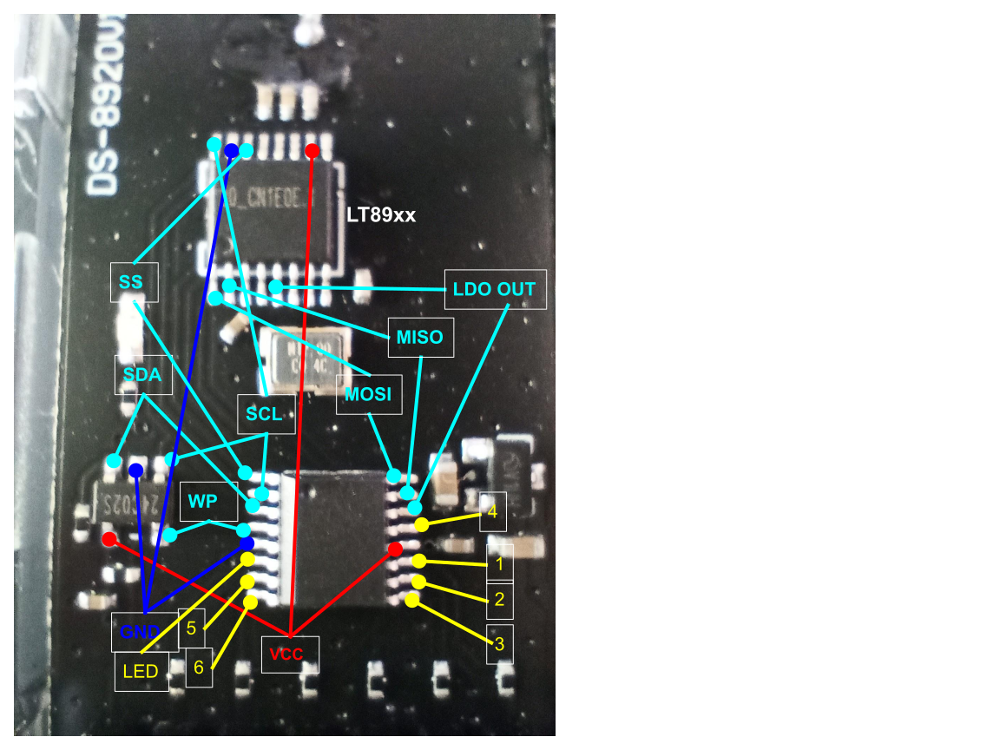
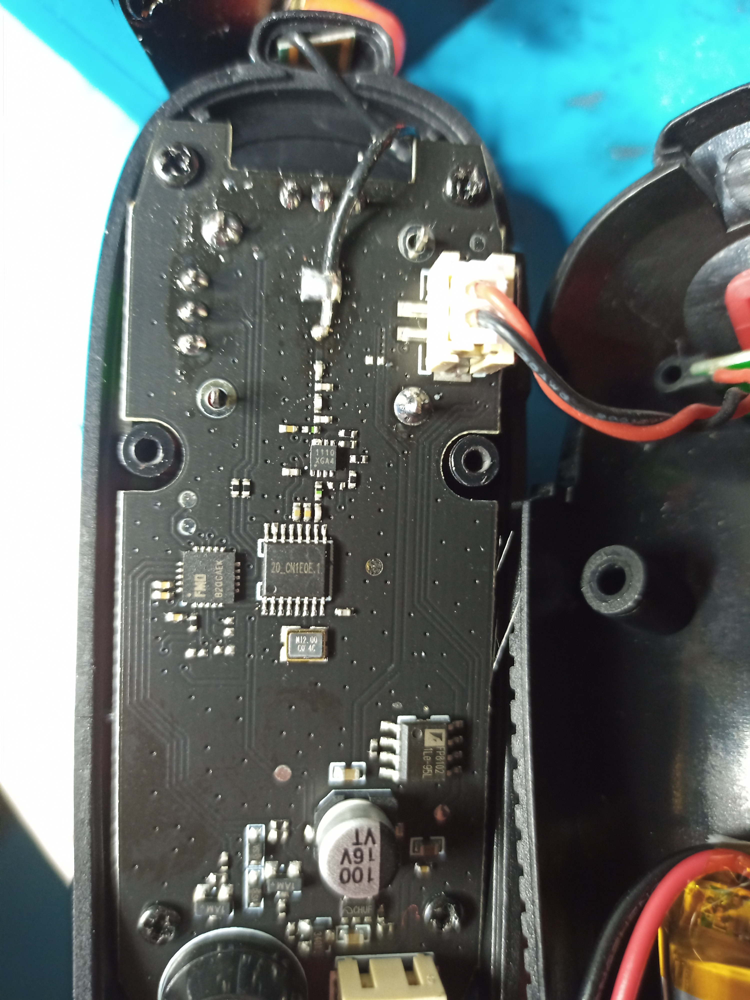

Receiver
===
- Radio LT8920
- AT24C02, 2K SERIAL EEPROM
- MCU: NUvoton N79E715 o N79E845/844/8432 ? No…

Transmitter
===
- MCU: Fremont Micro Devices FT61E0Ax ?
- Radio: IC LT89xx
- Battery manager: FP8102XR-G1

SPI capture from receiver
===
List of channels
---
34 74 04 44 29 69 09 49 (hex)

Register values
---

All values marked with \* are recommended in the datasheet

| # |value            |comment                                                |
|---|-----------------|-------------------------------------------------------|
|00 |6FE0\*|?                                                      |
|02 |6617\*|?                                                      |
|04 |9CC9\*|?                                                      |
|05 |6637\*|?                                                      |
|07 |0000             |disable RX/TX                                          |
|08 |6C90             |?                                                      |
|09 |1840\*|Sets Tx power level1                                   |
|11 |0008\*|RSSI enabled                                           |
|13 |48BD\*|?                                                      |
|22 |00FF\*|?                                                      |
|23 |8005\*|Calibrate VCO before each and every Tx/Rx              |
|24 |0067\*|?                                                      |
|26 |19E0\*|?                                                      |
|27 |1300\*|No crystal trim1                                       |
|32 |6800\*|PREAMBLE\_LEN=4 bytes, SYNCWORD\_LEN=32 bits, TRAILER\_LEN=4 bits, DATA_PACKET\_TYPE=NRZ law, FEC\_TYPE=No FEC, BRCLK\_SEL=keep low|
|33 |3FC7\*|Configures packet sequencing                           |
|34 |2000\*|Configures packet sequencing                           |
|35 |0300\*|AutoAck max Tx retries = 31                            |
|40 |4401             |FIFO\_EMPTY\_THRESHOLD=16, FIFO\_FULL\_THRESHOLD=16, SYNCWORD\_THRESHOLD=0|
|41 |B400             |CRC ON, scramble off, packet length enabled, FW\_TERM\_TX on, AUTOACK off, PKT\_FIFO\_POLARITY active low, CRC\_INITIAL\_DATA=0|
|42 |FDB0\*|Number of consecutive channels to scan for RSSI value (64); Wait RX\_ack ID timer setting. 176µs|
|44 |0800             |Datarate: 125Kbps                                      |
|45 |0552             |Best value is 0552H when data rate is 250Kbps/125Kbps/62.5KBps|
|39 |F3AA             |SYNC word #1                                           |
|36 |180C             |SYNC word #2                                           |
|52 |8080             |clear TX FIFO, clear RX FIFO                           |
|07 |00A2             |enables reception on channel 34 (2436MHz)              |

Pairing
===
At power on the transmitter sends 20 identical packets on channel 33, each 20 bytes long, one every 10ms. SYNC WORD = 0x12345678.

| data | meaning                              |
|------|--------------------------------------|
|  24  | ?                                    |
|**AA**| SYNC WORD, byte 2 (first always=F3 ?)|
|**18**| SYNC WORD, byte 3                    |
|**0C**| SYNC WORD, byte 4                    |
|**22**| First channel                        |
|**4A**| Second channel                       |
|**04**| ...                                  |
|**2C**| ...                                  |
|**1D**| ...                                  |
|**45**| ...                                  |
|**09**| ...                                  |
|**31**| Eigth channel                        |
|  27  | ?                                    |
|  4F  | ?                                    |
|  13  | ?                                    |
|  3B  | ?                                    |
|  0E  | ?                                    |
|  36  | ?                                    |
|  18  | ?                                    |
|  40  | ?                                    |

Data streming
===
One packet every 5ms

PWM
===
Frequency 50Hz, duty cycle 4.8% - 9.6% (960-1920µs)